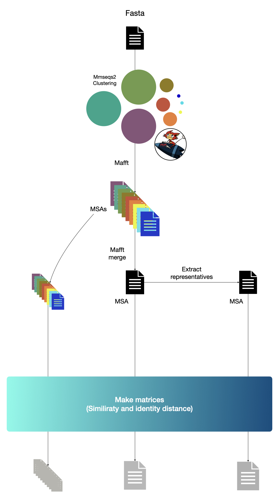

# ClusteringModule

Use mmseqs2 for sequence clustering. If --per-clu-msa is set, each cluster is aligned using mafft and MSAs produced are merged with mafft-merge utility. 


<figure><figcaption>workflow</figcaption></figure>

# DEPENDENCIES :
    - snakemake
    - pyyaml
    - pandas
    
# INPUT :
    - a fasta file.
    
# OUTPUT:
    -res_dir/<fasta_name>/clustering/tables/clusters.tsv 
    -res_dir/<fasta_name>/clustering/tables/identity.tsv 
    -res_dir/<fasta_name>/clustering/alignements/clusters.msa.aln

# INSTALLATION:
```bash
 git clone git@github.com:K2SOHIGH/CluALN.git && cd CluALN;
 mamba create -n clualn python=3 && conda activate clualn;
 mamba install pyyaml snakemake pandas
 pip3 install . ;
```

# USAGE : 
```bash
usage: clualn [-h] -i CLU_INPUT [-o RES_DIR] [-m] [-c COVERAGE] [--cm {0,1,2,3}] [--clumode {0,1,2}] [--pid PID] [-v VERBOSE] [--log LOG] [-e EXTENSION] [--snakargs SNAKARGS]

Cluster sequences , perform MSA per cluster and merge MSA

optional arguments:
  -h, --help            show this help message and exit
  -i CLU_INPUT, --input CLU_INPUT
                        a fasta file
  -o RES_DIR, --output-directory RES_DIR
                        output directory
  -m, --per-clu-msa     if set, each cluster will be aligned using MAFFT and then merged using MAFFT merge
  -c COVERAGE, --coverage COVERAGE
                        coverage threshold for clustering [0:1] (default: 0.8)
  --cm {0,1,2,3}        mmsmeqs coverage mode (default: 0)
  --clumode {0,1,2}     mmseqs cluster mode (default: 1)
  --pid PID             sequence identity threshold for clustering [0:1] (default: 0)
  -v VERBOSE            mmseqs verbose
  --log LOG             logfile
  -e EXTENSION, --extension EXTENSION
                        sequence file extension if input is a directory
  --snakargs SNAKARGS   snakmake arguments
```
 
