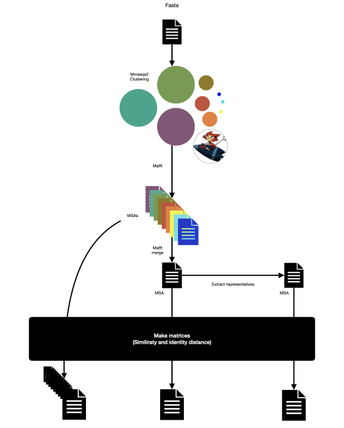

# CluALN

CluALN will use [mmseqs2](https://github.com/soedinglab/MMseqs2) to cluster sequences. 
If --per-clu-msa is set, then each cluster will be aligned using [mafft](https://mafft.cbrc.jp/alignment/software/) and for each a distance matrix will be build.
If --merge is set, then MSA from each cluster will be merged using [mafft-merge](https://mafft.cbrc.jp/alignment/software/merge.html). Representative sequences alignment will be extracted from this global MSA and distance matrices will be build for both of them.


## DEPENDENCIES :
    - snakemake
    - pyyaml
    - pandas
    
## DEPENDENCIES handled by snakemake
    - mmseqs2
    - mafft
    - biopython
    
## INPUT :
    - a fasta file.
    
## OUTPUT:
```
<res_dir>
├── clustering
│   ├── clusterDB
│   ├── fastas
│   ├── profilDB
│   └── tables
├── merged
│   ├── alignements
│   └── tables
├── per_cluster
└── representatives
    ├── alignements
    └── tables
```

## INSTALLATION:
```bash
 mamba create -n clualn python=3 && conda activate clualn ;
 mamba install pyyaml snakemake pandas ;
 pip3 install git@github.com:K2SOHIGH/CluALN.git ;
```

## USAGE : 
```
usage: clualn [-h] -i CLU_INPUT [-o RES_DIR] [-p] [-m] [-c COVERAGE] [--covmode {0,1,2,3}] [--clumode {0,1,2}] [--pid PID] [-v {0,1,2,3}] [-t THREADS] [--log LOG] [--snakargs SNAKARGS]

Cluster sequences , perform MSA per cluster and merge MSA

options:
  -h, --help            show this help message and exit
  -i CLU_INPUT, --input CLU_INPUT
                        a fasta file
  -o RES_DIR, --output-directory RES_DIR
                        output directory
  -p, --per-cluster-msa
                        if set, each cluster will be aligned using mafft and pairwise matrices will be build
  -m, --merge           if set, cluster MSA will be merged [warning ... might be slow]
  -c COVERAGE, --coverage COVERAGE
                        coverage threshold for clustering [0:1] (default: 0.8)
  --covmode {0,1,2,3}   mmsmeqs coverage mode (default: 0)
  --clumode {0,1,2}     mmseqs cluster mode (default: 0)
  --pid PID             sequence identity threshold for clustering [0:1] (default: 0)
  -v {0,1,2,3}          mmseqs verbose [0 -> nothing, 1 -> +errors, 2 -> +warnings, 3 -> +info]
  -t THREADS, --threads THREADS
                        number of threads
  --log LOG             logfile
  --snakargs SNAKARGS   snakmake arguments
```

### WORKFLOW :
<figure><figcaption>workflow</figcaption></figure>
 
